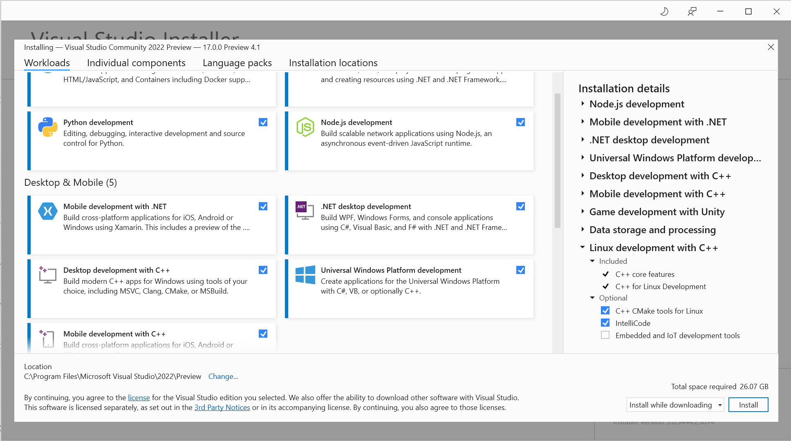
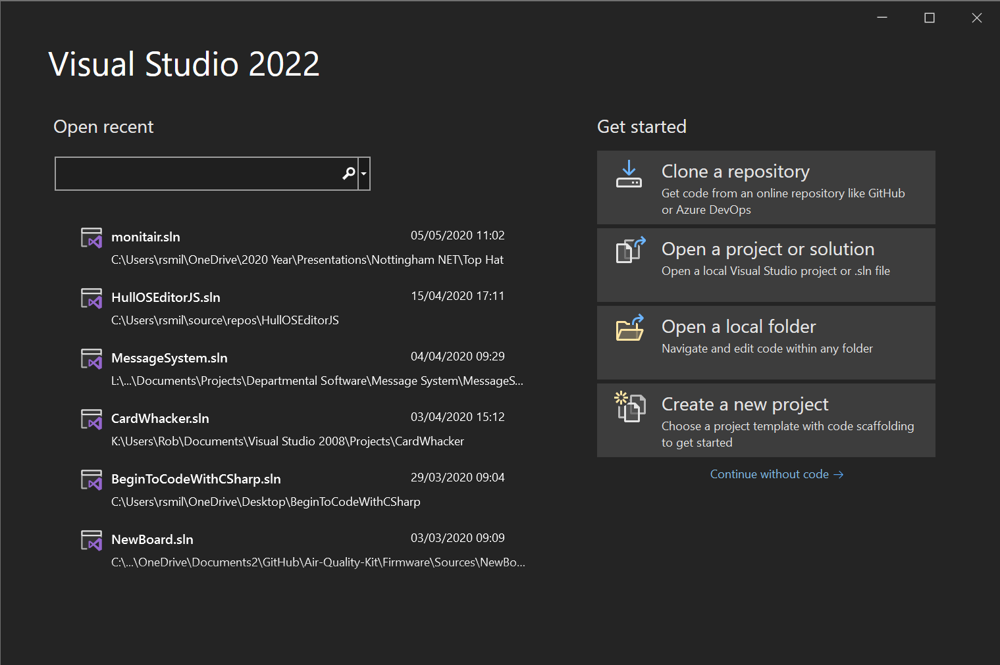
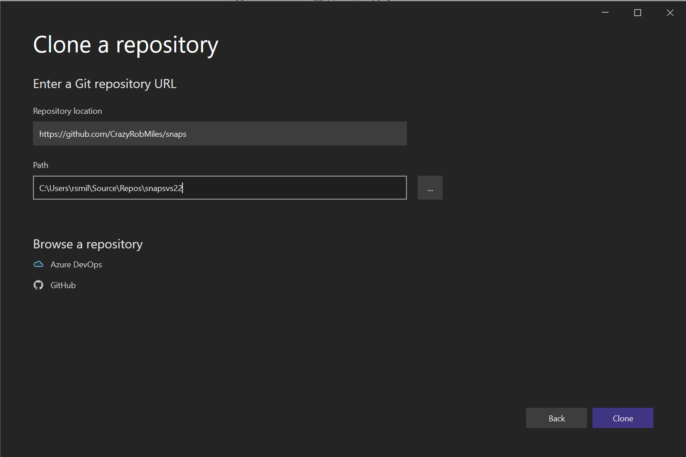
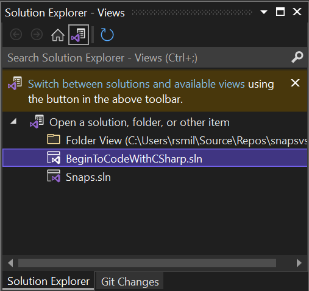
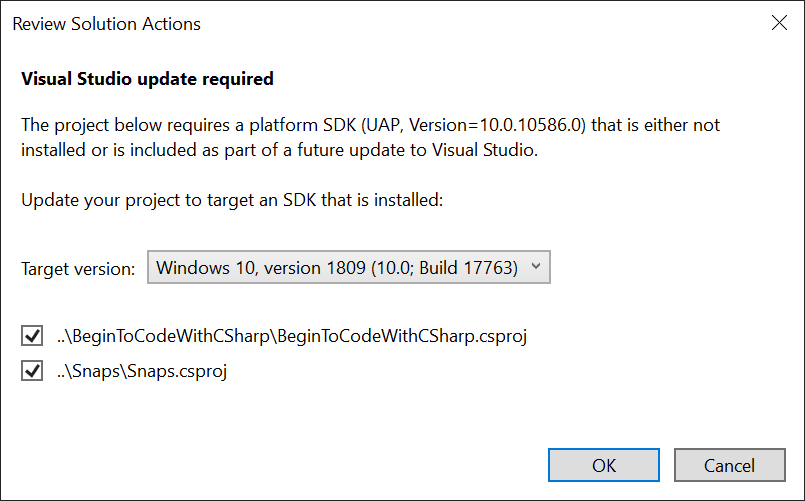
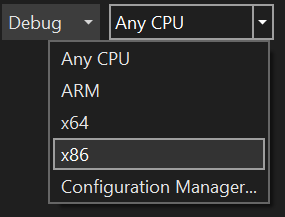
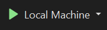
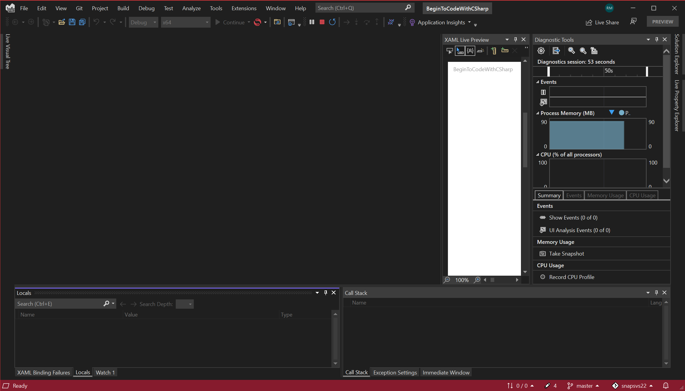
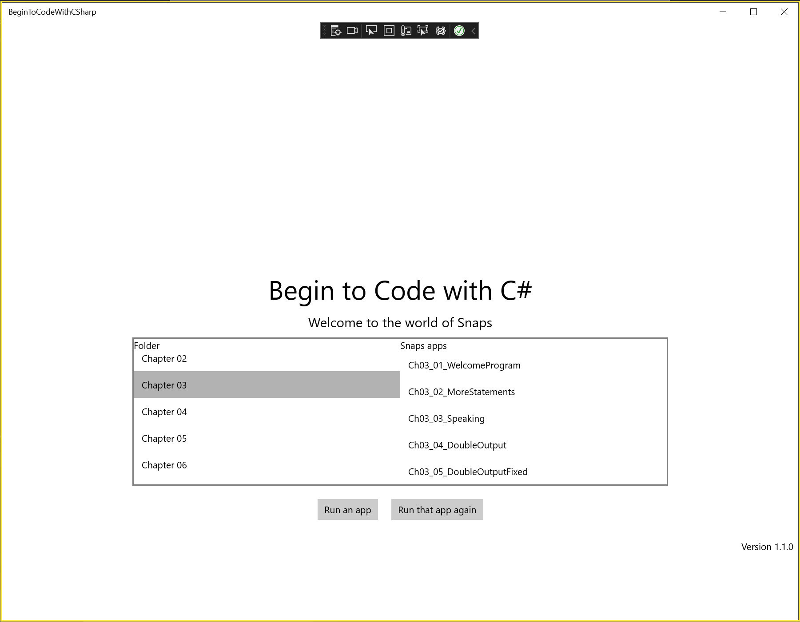

# Snaps
The C# Snaps framework used in the book [Begin to Code with C# by Rob Miles](https://www.microsoftpressstore.com/store/begin-to-code-with-c-sharp-9781509301157). 
## Visual Studio 2022 Snaps Installation
Snaps will work with the latest version of Visual Studio, Visual Studio 2022. You can download the community edition for free [here](https://visualstudio.microsoft.com/vs/preview/). Once the installer is running you can start to configure your installation to run Snaps.

First you need to make sure that when you install Visual Studio you include the Universal Windows Platform Development component. You can see it at the bottom right of the options shown in the Visual Studio Installer above above. Then, once Visual Studio 2022 has started after installation you can get the Snaps framework straight from GitHub. 

If you've already installed Visual Studio 2022 and aren't sure if you have the Universal Windows Development component installed you can open the installer using the **Tools** menu and select **Get Tools and Features**. 

Once you have installed and started Visual Studio 2022 you will see the startup page:

This is the startup page for Visual Studio 2022. To get a copy of Snaps (you will only have to do this once) click “Clone a repository” at the top left. Then you can fetch the Snaps framework from Github.

You use this dialog to copy Snaps from GitHub into a folder on your machine. Snaps are on GitHub here (this is the site you are presently at):

https://github.com/CrazyRobMiles/snaps

Type this address into the Repository location box, make sure that the destination path is a sensible place to put Snaps and then click Clone in the bottom left. This will bring down the framework and open it.

Once you have downloaded the repository you will find all the repository contents are displayed in the Solution Explorer window at the top right hand side of Visual Studio.

Solution Explorer lets you explore the solutions in the repository. There are two solutions, BeginToCodeWithCSharp holds all the example programs from the book, plus the browser that you use to explore them. Snaps holds the Snaps library functions.  You need to open the BeginToCodeWithCSharp as above. You will have to do this each time you start with the repository in Visual Studio 2022. 

You need to open the BeginToCodeWithCSharp as above. You will have to do this each time you start with the repository in Visual Studio 2022.  Do this by double clicking the solution line in the explorer above. 

The very first time you run the solution Visual Studio 2022 will ask if you want to install the libraries that it uses. This only needs to be done once, just click OK to install them. Now you need to configure the target device for the application.

Before you can run the Snaps browser you need to tell Visual Studio the hardware platform that you want to use. This is initially set to “Any CPU”. Open up the selection and choose “x86” from the menu at the top of Visual Studio.

Now you can hit the green arrow to start the program running. 

This is the Visual Studio 2022 display you’ll see when your Snaps program is running. 

This is the Snaps example browser. Select a program and click "Run an app" to run it. 
